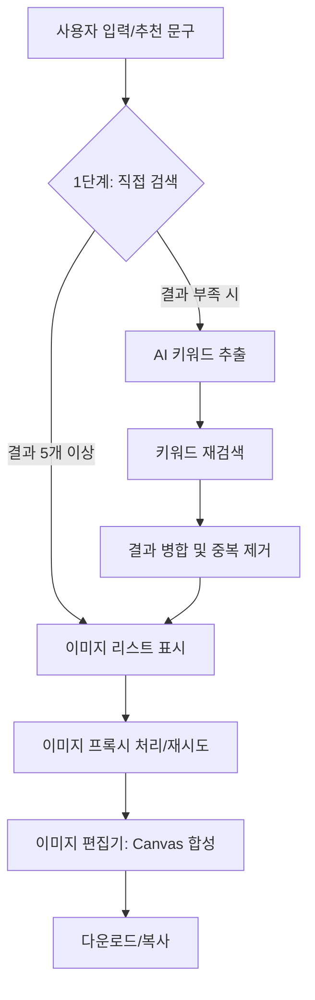

# 📸 짤-칵! (Jjal-kak!) 구현 가이드

> "문장만 입력하세요. 완벽한 짤은 AI가 찾아드릴게요."

사용자의 의도를 분석해 최적의 밈(Meme)을 찾아내고, 나만의 문구를 입혀 완성하는 **No-DB 클라이언트 기반 이미지 큐레이션 서비스**입니다.

**배포 주소**: https://kakao-sun-flower.github.io/jjal-kak/

---

## 1. 서비스 개요 💡

### 핵심 컨셉

사용자가 입력한 문장에서 AI가 핵심 키워드를 추출하고, 이를 기반으로 네이버에서 관련 이미지(짤/밈)를 검색합니다. 서버 비용 걱정 없는 **No-DB 클라이언트 중심 설계**로 빠르고 가벼운 경험을 제공합니다.

### 주요 기능

- **지능형 2단계 검색**:
  - 1차로 입력어 기반 직접 검색을 수행합니다.
  - 결과가 부족할 경우, AI가 맥락을 분석해 추출한 키워드로 2차 재검색을 진행하여 풍부한 결과를 보장합니다.

- **스마트 텍스트 오버레이**: 선택한 이미지 위에 사용자가 원하는 문구를 직접 합성하여 나만의 짤을 만듭니다.

- **강력한 공유 기능**: 완성된 이미지는 PNG로 다운로드하거나 클립보드에 즉시 복사하여 사용할 수 있습니다.

- **추천 문구 셔플**: 무엇을 검색할지 고민되는 사용자를 위해 버튼 클릭 한 번으로 추천 문구 검색 기능을 제공합니다.

---

## 2. 기술 스택 🛠

| 구분 | 기술 | 용도 |
|------|------|------|
| Frontend | React, Vite | 컴포넌트 기반 SPA 개발 및 빠른 빌드 |
| AI Engine | OpenAI API (gpt-5-mini) | 문장 내 핵심 키워드 추출 (로컬 환경 전용) |
| CORS Proxy | Allorigins, Corsproxy.io | 외부 검색 결과 데이터 수집 우회 |
| Image Proxy | wsrv.nl, weserv.nl | 이미지 핫링크 차단 해결 및 최적화 |
| Graphics | Canvas API | 클라이언트 사이드 이미지 합성 및 렌더링 |
| Styling | CSS3 | 반응형 다크 테마 디자인 |

---

## 3. 서비스 아키텍처 및 흐름도 🏗️



> **Insight**: 검색 실패 시 사용자가 흐름을 끊지 않도록 구글, DC인사이드, 에펨코리아 등 외부 커뮤니티로의 바로가기 링크를 제공하는 **폴백(Fallback) 전략**을 갖추고 있습니다.

---

## 4. 핵심 구현 상세 뜯어보기 🔍

### 4.1 이미지 검색 및 데이터 정규화 (imageSources.js)

다양한 출처의 이미지를 효율적으로 관리하기 위해 URL 정규화를 거쳐 중복을 제거합니다.

- **URL 정규화**: 쿼리 스트링(사이즈, 퀄리티 옵션 등)을 제거하여 동일한 원본 이미지가 중복 노출되는 것을 방지합니다.
- **CORS 대응**: 다중 프록시 배열을 운영하여 특정 프록시 서버가 응답하지 않을 경우 다음 서버로 자동 전환됩니다.

### 4.2 안정적인 이미지 로딩 로직 (ImageCard.jsx)

이미지 핫링크 차단으로 인해 엑박(Broken Image)이 뜨는 현상을 방지하기 위해 **3단계 재시도 로직**을 구현했습니다.

1. wsrv.nl 프록시 시도
2. 실패 시 images.weserv.nl 시도
3. 최종 실패 시 원본 URL 또는 로컬 폴백 이미지 노출

### 4.3 AI 키워드 추출 및 폴백 전략 (openai.js)

- **로컬 환경**: gpt-5-mini 모델을 사용하여 정교한 키워드를 추출합니다.
- **배포 환경**: API 키 노출 방지를 위해, 한국어 조사를 제거하고 핵심 명사를 분리하는 **자체 알고리즘(Custom NLP Fallback)**을 사용하여 끊김 없는 서비스를 제공합니다.

---

## 5. UI/UX 디자인 가이드 🎨

### 비주얼 컨셉: "Deep & Vibrant"

- **Background**: 깊이감 있는 다크 네이비 그라데이션 (`#1a1a2e` → `#16213e`)
- **Point Color**: 활기찬 에너지를 주는 오렌지-레드 (`#f39c12`, `#e74c3c`)
- **Layout**: 모바일 우선 대응(Mobile-First) 디자인으로, 768px 이하 기기에서도 최적의 그리드를 유지합니다.

### 사용자 여정 (User Journey)

1. **진입**: 로고 클릭으로 언제든 초기화 가능
2. **검색**: 문장 입력만으로 AI가 태그를 생성하고 이미지 로드
3. **편집**: 마음에 드는 이미지를 클릭해 즉시 문구 편집 모드 진입
4. **완성**: 결과물 저장 혹은 커뮤니티에 즉시 활용

---

## 6. 프로젝트 실행 및 배포 🚀

### 로컬 개발 설정

```bash
# 의존성 설치 및 실행
npm install
npm run dev
```

### 환경 변수 관리

로컬에서 AI 기능을 풀버전으로 사용하려면 `.env` 파일이 필요합니다.

```
VITE_OPENAI_API_KEY=your_api_key_here
```

### 배포 프로세스

```bash
npm run deploy
```

gh-pages를 통해 자동 배포되며, 보안을 위해 배포 빌드 시 API 키는 자동으로 제외되도록 구성되었습니다.

---

## 7. 향후 로드맵 🗺️

- **성능 최적화**: Cloudflare Workers를 활용한 자체 서버리스 프록시 구축
- **개인화**: 로컬 스토리지를 활용한 '내가 만든 짤' 보관함 기능
- **검색 확장**: 핀터레스트, 구글 이미지 등 검색 소스 다각화
- **AI 고도화**: 사용자 입력 문장의 감정을 분석하여 어울리는 폰트/색상 자동 추천
